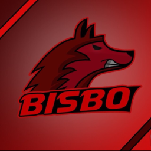

# Chris' User Page

## About Me!

I'm Chris, an international student from Greece studying Computer Science at UCSD!

### My **Skills**: 

I can use a plethora of different programming languages, including some unique ones like GML!

My favourite quote is:

> "It's not enough to give people what they need to survive. You gotta give them what they need to live." - Ekko (Arcane)

### Here's a code sample:
```
git add
git commit
```

I made this with [Github Pages](https://pages.github.com/).

### Now time for more links!

Here is a link to the first section of the page! [Link](#chris-user-page)

Now, here is a link to the Read Me file! [Readme](README.md)

Here is a list of some of my favourite games of all time:

- Undertale
- League of Legends
- Dead Cells
- Minecraft
- Counter Strike 
- Risk of Rain 2

Now, here is the same list but ordered!

1. Undertale
2. Minecraft
3. League of Legends
4. Risk of Rain 2
5. Dead Cells
6. Counter Strike


# my logo

Here is a cool logo I made years ago!


